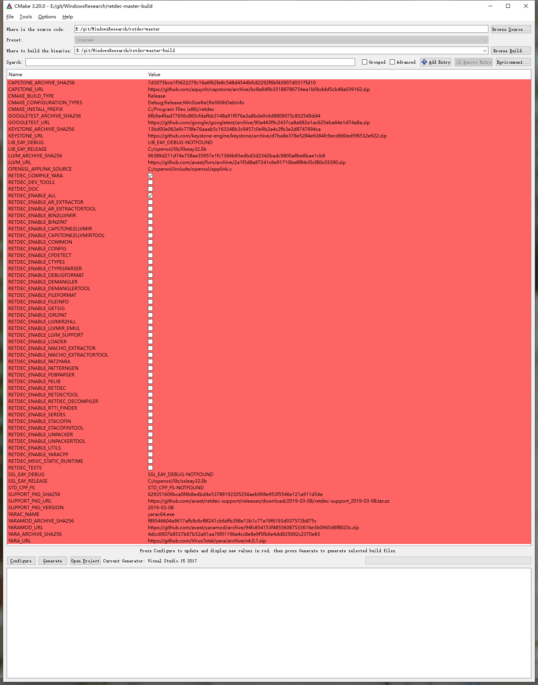
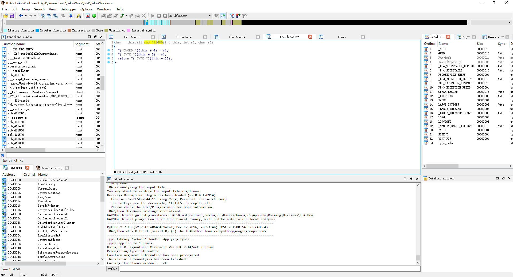
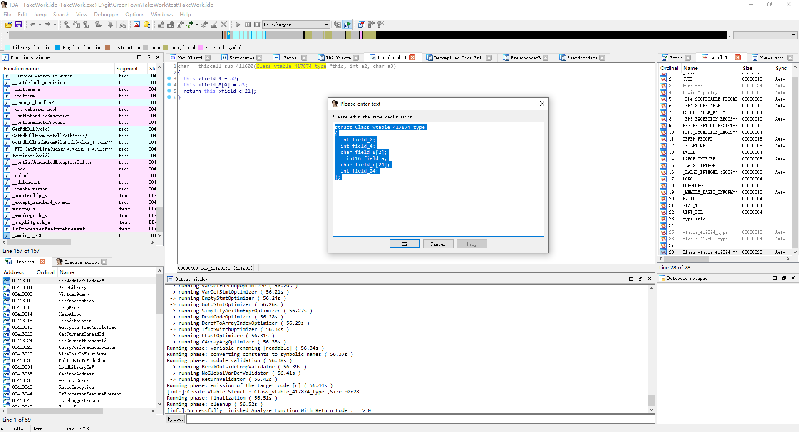

## 引用 ##

>这篇文章旨在介绍一款对基于LLVM的retdec开源反编译器工具进行二次开发的IDA自动结构体识别插件实现原理分析

[toc]

## 简介 ## 

笔者在一款基于LLVM编译器架构的[retdec](https://github.com/avast/retdec)开源反编译器工具的基础上,融合了[klee](https://github.com/klee/klee)符号执行工具,通过符号执行(Symbolic Execution)引擎动态模拟反编译后的llvm的ir(中间指令集)运行源程序的方法,插桩所有的对x86指令集的thiscall类型函数对this指针结构体(也就是rcx寄存器,简称this结构)偏移量引用,经行分析汇总后自动识别this结构体的具体内容,并自动集成导入ida工具辅助分析.


## 源码分析 ## 

### LLVM编译器简介 ### 

LLVM 命名最早源自于底层虚拟机（Low Level Virtual Machine）的缩写,由于命名带来的混乱,LLVM就是该项目的全称.LLVM 核心库提供了与编译器相关的支持,可以作为多种语言编译器的后台来使用.能够进行程序语言的编译器优化、链接优化、在线编译优化、代码生成.LLVM的项目是一个模块化和可重复使用的编译器和工具技术的集合.LLVM是伊利诺伊大学的一个研究项目,提供一个现代化的,基于SSA(static single assignment静态单一赋值)的编译策略能够同时支持静态和动态的任意编程语言的编译目标。自那时以来,已经成长为LLVM的主干项目,由不同的子项目组成,其中许多是正在生产中使用的各种 商业和开源的项目,以及被广泛用于学术研究.本文介绍的几款相关工具都是基于LLVM编译器架构.

### Retdec源码分析 ### 

[retdec](https://github.com/avast/retdec)是一款基于LLVM编译器架构的支持多种机器码环境的跨平台反编译工具,输入为任意支持的二进制可执行文件,目标输出为一个可以再次编译的C语言的源码文件.

克隆git仓库后使用[Cmake GUI](https://cmake.org/download/)工具使用如下图配置将源工程及LLVM依赖工程转为Visual Studio 2017工程,笔者提供的工程已经是转换后的vs工程,可以直接在vs中打开编译.



笔者的工程包含2个主要项目,一个是retdec-decompiler用于反编译输入二进制文件至c语言的源码输出文件,另外一个是IDA自动结构体识别插件,这2个都是依赖于llvm的独立项目.
x86指令集的[__thiscall](https://docs.microsoft.com/zh-cn/previous-versions/visualstudio/visual-studio-2012/ek8tkfbw(v=vs.110))调用约定不同于[__stdcall](https://docs.microsoft.com/zh-cn/previous-versions/visualstudio/visual-studio-2012/zxk0tw93(v=vs.110))参数从右向左被推入堆栈,而this指针由寄存器rcx传递而不是堆栈,也就是说rcx指向this结构体指针,一般是在类构造函数中申请的类结构体指针的地址,申请大小固定后不会改变.这个结构体由从派生类到基类的顺序叠加在一起,每个类的指针首地址指向一个vftable虚表函数结构体包含了当前类所有的包括重写虚函数在内的类成员函数数组,而这个vftable的地址减去一个sizeof(void*)大小后指向一个RTTICompleteObjectLocator结构体,它的相关结构体描述了这个类C++的所有多态性（运行时）相关信息,具体可以参考[dynamic_cast实现原理](https://blog.csdn.net/passion_wu128/article/details/38511957?depth_1-)相关文章,相关结构体如下,retdec原有代码分析x64的rtti结构体有问题,主要出在偏移量为int32类型是基于模块基址的偏移而不是绝对地址,这个问题笔者已修复.
```
typedef struct TypeDescriptor
{
	void *	pVFTable;		// Field overloaded by RTTI
	void *	spare;			// reserved, possible for RTTI
	char	name[];			// The decorated name of the type; 0 terminated.类名称
} TypeDescriptor;
struct PMD
{
  ptrdiff_t mdisp; //member displacement vftable offset
  ptrdiff_t pdisp; //vftable displacement vftable offset
  ptrdiff_t vdisp; //displacement within vftable offset(for virtual base class)
}; 
typedef const struct _s_RTTIBaseClassDescriptor
{
  TypeDescriptor                  *pTypeDescriptor;
  DWORD                           numContainedBases;
  PMD                             where;
  DWORD                           attributes;
} _RTTIBaseClassDescriptor; 
typedef const struct  _s_RTTIBaseClassArray
{
  _RTTIBaseClassDescriptor* arrayOfBaseClassDescriptors[3];
}_RTTIBaseClassArray; 
typedef const struct _s_RTTIClassHierarchyDescriptor
{
  DWORD                           signature;
  DWORD                           attributes;
  DWORD                           numBaseClasses;
  _RTTIBaseClassArray             *pBaseClassArray;
}_RTTIClassHierarchyDescriptor; 
typedef const struct _s_RTTICompleteObjectLocator
{
  DWORD                           signature;
  DWORD                           offset;			 //vftbl相对this的偏移
  DWORD                           cdOffset;		 //constructor displacement 
  TypeDescriptor                  *pTypeDescriptor;
  _RTTIClassHierarchyDescriptor   *pClassDescriptor;
}_RTTICompleteObjectLocator;
typedef struct TypeDescriptor
{
#if defined(_WIN64) || defined(_RTTI) || defined(BUILDING_C1XX_FORCEINCLUDE)
	const void * pVFTable;	// Field overloaded by RTTI
#else
	unsigned long	hash;			// Hash value computed from type's decorated name
#endif
	void *	spare;			// reserved, possible for RTTI
	char			name[];			// The decorated name of the type; 0 terminated.
	} TypeDescriptor;
```
在缺少调试符号和dll导出函数名的情况下,一般最多只能通过解析二进制程序内的rtti结构体获得有限的可用信息,比如类名称和继承关系等,ida默认会自动识别基于ms和gcc等编译器生成的rtti结构体,如果用户觉得不够全面可以使用[classinformer](https://sourceforge.net/projects/classinformer/)这款ida插件暴力搜索所有符合条件的rtti结构体,提供汇总分析功能.笔者工具中也提供一个功能将vftable所有的包含函数加入分析器统一分析,类似的功能还有对MFC窗口的AFX_MSGMAP_ENTRY结构体包含的相关目标函数分析.由于这些成员函数都是thiscall类型,所以rcx总是指向同一个派生类结构体,把这些函数根据vftable地址分类进行分析显然是个很好的办法.这些功能在工具中集成进了ida提供添加目标函数加入分析队列,具体使用方法见工具使用介绍节.
LLVM整体架构,前端用的是clang,广义的LLVM是指整个LLVM架构,一般狭义的LLVM指的是LLVM后端（包含代码优化和目标二进制代码生成),前端clang用于分析高级语言源代码产生后端的LLVM IR中间指令表示.LLVM IR中间指令是一种"通用中间语言"采用SSA形式,可以拥有无限多个虚拟寄存器且是抽象与高级语言和目标最终编译输出二进制文件架构约束无关,它通过提供类型信息可以用于进一步提供优化转化为目标代码生成也可以反过来转化成类似c的高级语言表示.编译为目标二进制代码生成的功能不在本文的讨论范围,文本主要讨论反编译过程和模拟LLVM IR中间指令执行分析获得this结构体的相关信息实现方式.
retdec工具使用的反编译引擎是[capstone2llvmir](https://github.com/chubbymaggie/capstone2llvmir),主要由"retdec-decoder"这个llvm Passe负责将源程序二进制汇编ASM代码转化成LLVM IR中间指令,在转换初始化之前从程序入口、调试信息和Vftables获取静态已知的跳转目标JumpTargets用于构造整个程序的LLVM IR Selection DAG(directed acyclic graph有向无环图),对后续的跳转目标进行指令集顺序上的调度优化转化为retdec的等价DAG的节点CFGNode及其组织架构.
```
//获取静态已知的跳转目标JumpTargets
void Decoder::initJumpTargets()
{
	initJumpTargetsConfig();
	initStaticCode();
	initJumpTargetsEntryPoint();
	initJumpTargetsExterns();
	initJumpTargetsImports();
	initJumpTargetsDebug();
	initJumpTargetsSymbols();
	initJumpTargetsExports();
	initVtables();
}
//递归解析每个跳转目标JumpTarget直到没有跳转目标
void Decoder::decode()
{
	JumpTarget jt;
	while (getJumpTarget(jt))
	{				
		decodeJumpTarget(jt);
	}
}
//递归解析每个跳转目标JumpTarget
void Decoder::decodeJumpTarget(const JumpTarget& jt)
{
    //使用反编译引擎capstone2llvmir转换ASM指令
	auto res = translate(bytes, addr, irb);
	llvm::CallInst*& pCall = res.branchCall;
	//处理所有call类型及其条件call类型
	if (_c2l->isCallFunctionCall(pCall)||_c2l->isBranchFunctionCall(pCall)||_c2l->isCondBranchFunctionCall(pCall))
	{
	auto t = getJumpTarget(addr, pCall, pCall->getArgOperand(0)){
	     //生成SymbolicTree
	    auto st = SymbolicTree::OnDemandRda(val, 20);
		//获取跳转目标JumpTarget的常量值
	    llvm::ConstantInt* ci = nullptr;
		if (match(st, m_ConstantInt(ci)))
		{
			return ci->getZExtValue();
		}
	}
	//处理分支跳转条件表addrTblCi和索引计算获取所有跳转cases加入JumpTarget
	getJumpTargetSwitch(addr, branchCall, val, st){
	if(match(st, m_Load(
				m_c_Add(
					m_CombineOr(
						m_c_Mul(m_Value(), m_ConstantInt(mulShlCi), &mulOp),
						m_Shl(m_Value(), m_ConstantInt(mulShlCi), &shlOp)),
					m_ConstantInt(addrTblCi))))){
	  llvm::Value* idx = mulOp ? mulOp->getOperand(0) : shlOp->getOperand(0);
      std::vector<Address> cases;	  
	  while (true)
		{
		  Address item = addrTblCi->getZExtValue();
		  addrTblCi += pointersize;
		  cases.push_back(item);
		}
	  for (auto c : cases)
		{
			_jumpTargets.push(
				c,
				JumpTarget::eType::CONTROL_FLOW_SWITCH_CASE,
				_c2l->getBasicMode(), // mode should not change here
				addr);			
		}	
	  }
	};	
   	_jumpTargets.push(t,JumpTarget::eType::CONTROL_FLOW_CALL_TARGET,determineMode(tr.capstoneInsn, t),addr);
	}else if (_c2l->isReturnFunctionCall(pCall))
	{
	//如果是返回指令类型直接创建ReturnInst
	transformToReturn(pCall);
	}
	
}
```
retdec-decoder反编译模块递归解析每个跳转目标JumpTarget,调用capstone2llvmir::translate函数将汇编指令转化成LLVM IR中间指令,在解析跳转目标的过程中又可以根据其分支类型,主要有call类型及其(分支)条件call类型和返回指令类型,从中获取新的跳转目标加入到待处理的列表中,直到没有跳转目标完成整个程序的反编译解码过程.
```
capstone2llvmir::Capstone2LlvmIrTranslator::TranslationResultOne
		Decoder::translate(ByteData& bytes, common::Address& addr, llvm::IRBuilder<>& irb)
{
cs_insn* insn = cs_malloc(_handle);
//调用capstone将二进制代码数据转换为cs_insn
bool disasmRes = cs_disasm_iter(_handle, &bytes, &size, &address, insn);
translateInstruction(insn, irb);
}

void Capstone2LlvmIrTranslatorX86_impl::translateInstruction(
		cs_insn* i,
		llvm::IRBuilder<>& irb)
{
//函数入口地址pc保存在"asm_program_counter"这个全局变量中
retdec::common::Address a = i->address;
auto* s = irb.CreateStore(llvm::ConstantInt::get(gv->getValueType(), a, false), asm_program_counter, true);
//这个表维护了所有可以转化的X86汇编指令
Capstone2LlvmIrTranslatorX86_impl::_i2fm =
{
...
{X86_INS_ADD, &Capstone2LlvmIrTranslatorX86_impl::translateAdd},
{X86_INS_MOV, &Capstone2LlvmIrTranslatorX86_impl::translateMov},
...
}
auto fIt = _i2fm.find(i->id);
if (fIt != _i2fm.end() && fIt->second != nullptr)
{
	auto f = fIt->second;
	//就是调用Capstone2LlvmIrTranslatorX86_impl::translateXXX
	(this->*f)(i, xi, irb);
}else{
//转换函数调用
void Capstone2LlvmIrTranslator_impl<CInsn, CInsnOp>::translatePseudoAsmGeneric(
	cs_insn* i,
	CInsn* ci,
	llvm::IRBuilder<>& irb)
   { 
	llvm::Function* fnc = getPseudoAsmFunction(
		i,
		retType,
		types);
	auto* c = irb.CreateCall(fnc, vals);
	//根据OperandAccess获取Call的返回值类型
	llvm::Value* val = retType->isVoidTy()
				? llvm::cast<llvm::Value>(
						llvm::UndefValue::get(getRegisterType(r)))
				: llvm::cast<llvm::Value>(c);
		storeRegister(r, val, irb);
   }		
}	
}
//对应转换函数
void Capstone2LlvmIrTranslatorX86_impl::translateXXX(cs_insn* i, cs_x86* xi, llvm::IRBuilder<>& irb)
{
    //创建汇编代码的对应指令
	std::tie(op0, op1) = loadOpXXX(xi, irb, eOpConv::SEXT_TRUNC_OR_BITCAST);
	auto* add = irb.CreateXXX(op0, op1);
	//生成指令操作
	op1 = loadOp(xi->operands[1], irb);
	storeOp(xi->operands[0], add, irb);
	if (i->id == X86_INS_XADD)
	{
		storeOp(xi->operands[1], op0, irb);
	}
}
```
cs_malloc分配capstone的handle,用这个handle通过cs_disasm_iter把二进制翻译为汇编生成capstone的insn结构,并把函数入口地址pc保存在"asm_program_counter"这个全局变量中,这只是起到的标识的作用,在后面的pass会自动把这个优化掉.然后调用translateInstruction从_i2fm这张全局指令解析表中获取对应的translateXXX转换函数将cs_insn转化成LLVM IR中间指令,如果不在表中则生成Function函数调用构造相关参数.
```
int main(int argc, char *argv[])
{
    std::vector<uint8_t> CODE = retdec::utils::hexStringToBytes("80 05 78 56 34 12 11 00");
	ProgramOptions po(argc, argv);	
	llvm::LLVMContext ctx;
	llvm::Module module("test", ctx);
	auto* f = llvm::Function::Create(
			llvm::FunctionType::get(llvm::Type::getVoidTy(ctx), false),
			llvm::GlobalValue::ExternalLinkage,
			"root",
			&module);
	llvm::BasicBlock::Create(module.getContext(), "entry", f);
	llvm::IRBuilder<> irb(&f->front());
	auto* ret = irb.CreateRetVoid();
	irb.SetInsertPoint(ret);	
	auto c2l = Capstone2LlvmIrTranslator::createArch(
			po.arch,
			&module,
			po.basicMode,
			po.extraMode);
	//调用capstone转换函数
	auto res=c2l->translate(po.code.data(), po.code.size(), po.base, irb);
	return EXIT_SUCCESS;
}
```
retdec为我们提供了一个demo工具[capstone2llvmirtool](https://gitee.com/cbwang505/llvmanalyzer/tree/master/retdec-master/src/capstone2llvmirtool)用于将指定二进制代码通过16进制字符串在命令行传入测试translate功能并输出结果,有兴趣的读者可以自己研究下.
```
bool HLLWriter::emitTargetCode(ShPtr<Module> module) {
...
//输出模块静态引用相关信息
if (emitXXXHeader()) {}
....
	emitFunctions();
...
}
//输出函数主体
bool HLLWriter::emitFunctions() {
	FuncVector funcs(module->func_definition_begin(), module->func_definition_end());
	sortFuncsForEmission(funcs);
	bool somethingEmitted = false;
	for (const auto &func : funcs) {
		if (somethingEmitted) {
			// To produce an empty line between functions.
			out->newLine();
		}
		somethingEmitted |= emitFunction(func);
	}
	return somethingEmitted;
}
void CHLLWriter::visit(ShPtr<Function> func) {
			if (func->isDeclaration()) {
				emitFunctionPrototype(func);
			}
			else {
				emitFunctionDefinition(func);
			}
}
void CHLLWriter::emitFunctionDefinition(ShPtr<Function> func) {
			PRECONDITION(func->isDefinition(), "it has to be a definition");

			out->addressPush(func->getStartAddress());
			emitFunctionHeader(func);
			out->space();
			emitBlock(func->getBody());
			out->addressPop();
			out->newLine();
}
//输出块主体
void CHLLWriter::emitBlock(ShPtr<Statement> stmt) {
			out->punctuation('{');
			out->newLine();
			increaseIndentLevel();
			// Emit the block, statement by statement.
			do {
				out->addressPush(stmt->getAddress());
				emitGotoLabelIfNeeded(stmt);

				// Are there any metadata?
				std::string metadata = stmt->getMetadata();
				if (!metadata.empty()) {
					emitDebugComment(metadata);
				}
				stmt->accept(this);
				out->addressPop();
				//递归后继直到没有后继
				stmt = stmt->getSuccessor();
			} while (stmt);

			decreaseIndentLevel();
			out->space(getCurrentIndent());
			out->punctuation('}');
}		
```
retdec内部构造的一个和LLVM IR中间指令等价的指令结构,这些指令又构成了和llvm::BasicBlock类等价的Statement等价结构,由CFGNode类负责管理每个Function的前驱后继和分支边.在CHLLWriter这个类中完成所有模块中的结构体和函数生成C语言高级代码的工作.从Module输出了模块的依赖结构体后,在emitFunctions环节CHLLWriter使用一个类Visitor->visit重载函数递归解析Function及其包含的内部Statement分支结构,递归Statement的所有后继和和分支边,直到没有后继子分支,在这个过程中输出内部变量retdec指令,至此全部反编译流程完成并输出至目标c文件.

### Klee源码分析 ### 

随着现代软件规模的加大、复杂度不断增加,对软件安全性的需求也不断上升,传统的分析测试技术因自身的局限已无法满足当前的软件安全性的需求.而符号执行技术因自身具有的优异特性在软件测试领域中受到了广泛的关注,常见和符号执行工具如[angr](https://github.com/angr/angr)(基于python),klee(基于llvm),[Triton](https://github.com/JonathanSalwan/Triton)(也是基于llvm)等.Klee对约束求解进行优化策略,将自身的STP求解器与微软公司开发的Z3求解器结合并行化工作,特点是具有自动化测试用例生成,程序路径覆盖率高,无需人工操作等优点,受到了当前众多高校和科技公司的关注,随着许多符号执行工具不断出现,在实际应用中取得了很好的成绩.但是符号执行技术还存在着一些需要亟待解决的关键问题如路径爆炸,指针计算以及约束求解等问题.Klee中的符号执行过程称为状态机(state machine)机制,通过将LLVMIR中间指令解释成Klee内建指令,并将代码中指令映射为约束条件的符号变量值(Symbolic Variable Value),通过模拟程序执行流程构建单元代码的控制流图,当选择代码路径遇到分支语句时,提取并存储不同分支的约束条件,使用约束求解器求解进入某一分支所要满足的约束,最后根据路径调度算法来对控制流图中的所有路径进行遍历分析,代入满足约束条件的值以进入该分支,并对执行过的程序路径进行记录,下一次执行到该分支时选择未进入的分支执行,这样逐步对程序中所有的可行路径进行遍历.用程序的语言表述是Klee在测试用例的入口处将一个配置好的初始状态(initial state)放入池中,循环地从状态池里选择状态,并在那个状态下符号化地执行每条指令.直到状态池里没有状态了,或者时间超过了用户设定的.与普通进程不同,状态寄存器、堆栈和堆对象的存储位置指的是Klee表达式（树）,而不是原始数据值.表达式的叶子节点是符号变量或常量,内部节点是LLVM IR中间指令的操作符（例如算术操作、按位操作、比较和内存访问）.存储常量表达式的存储内容是实际的整形常数值,变量的存储是嵌套的表达式树引用.
由于我们没有去解析要分析的目标二进制相关的依赖文件模块,也在无法创建真实的进程环境而是采用符号执行的方法模拟一个函数执行,这过程必然会丢失或者欠缺真实运行环境实际存在在内存中的一些东西,所以这种方法不能被当作虚拟化环境分析目标二进制程序(emulating execution in a virtual (emulated) environment)而是近似模拟符号执行,简单的说就是没有虚拟层.每当一次state迭代结束,state的出口条件分支是布尔表达式,Klee会去查询约束求解器来确定当前路径上的分支条件是否恒为真或假.如果恒为真或假,就更新指令指针到预计的位置,fork出一个新的state.反之两种分支都有可能.然后KLEE路径调度算法就会去复制当前状态,并从这个状态fork出两个新的state,这样就可以同时探索两条路径,并且同时更新指令指针和路径条件.
```
bool SymbolicTypeReconstructor::runOnModule(llvm::Module& m)
{
for (auto addr : image->getRtti().getVtablesMsvc())
{
    const Interpreter::InterpreterOptions opt;				
	RetdecInterpreterHandler			interpreterHandlerPtr = new RetdecInterpreterHandler(M);
	interpreter = Interpreter::create(ctx, opt, interpreterHandlerPtr);
	_config = ConfigProvider::getConfig(M);
	_module = _config->_module;
	interpreter->initSingleModule(M);
	DataLayout TD = _module->getDataLayout();
	Context::initialize(TD.isLittleEndian(),
						static_cast<Expr::Width>(TD.getPointerSizeInBits()));	
	llvm::Function* func = _config->getLlvmFunction(addr);
	char * argv = nullptr;
	char * env = nullptr;
	//构建runFunctionAsMain执行每个要分析的函数
	interpreter->runFunctionAsMain(func, 0, &argv, &env);	
}
}				
//重构函数入口处执行
void Executor::runFunctionAsMain(Function *f,
	int argc,
	char **argv,
	char **envp) {
	std::vector<ref<Expr> > arguments;{
ExecutionState *state = new ExecutionState(kmodule->functionMap[f]);
MemoryManager* memory = new MemoryManager(NULL);
//构建参数内存对象
MemoryObject* argvMO =
				memory->allocate((argc + 1 + envc + 1 + 1) * NumPtrBytes,
					/*isLocal=*/false, /*isGlobal=*/true,
					/*allocSite=*/first, /*alignment=*/8);
//初始化全局变量:
initializeGlobals(*state);					
void Executor::run(ExecutionState &state){
searcher = constructUserSearcher(*this);
std::vector<ExecutionState *> newStates(states.begin(), states.end());
searcher->update(0, newStates, std::vector<ExecutionState *>());
while (!states.empty() && !haltExecution) {
ExecutionState &state = searcher->selectState();
KInstruction *ki = state.pc;
stepInstruction(state);
executeInstruction(state, ki);
updateStates(&state);
}
```
ExecutionState由一个传入的Function构造初始状态,然后迭代执行里面的Instruction,具体工作由executeInstruction函数完成,内部分类模拟处理了所有指令类型,Function的自带参数被分配在它的StackFrame->locals字段,对应的是llvm::.Function::.Argument字段,从x86架构来讲32位的函数参数由esp传递,64位由rcx等寄存器和rsp传递,在初始化状态这些寄存器都被映射到对应的全局变量,也就是说是运行时赋值的,尽管llvm的Function构造时反编译程序已将关联的虚拟寄存器Value映射到这些参数.由于我们不知道要分析之前的函数实际运行时的参数值,我们只能构造一个伪造的预先分配rcx结构体和rsp栈结构体处理这些参数.这里我们要用到klee里有个很重要的概念就是内存模型。前面我们讲到klee的每个状态由ExecutionState解释执行,它的AddressSpace字段维护了所有运行时内存分配与调度,AddressSpace内部实际上维护的是一对MemoryObject和ObjectState组成的ObjectPair数组Map字典,这两个对象成对出现和使用描述的是同一块内存区域.在Memory.h定义文件里，我们可以看见有MemoryObject的定义,包含以下属性,包括id，地址，内存对象的大小等,这些信息仅供描述内存分配信息使用,而实际内存读写操作由ObjectState参与完成,它的地址由MemoryManager->allocate根据申请的大小分配相对映射地址,这个大小在申请时确定不能重分配.对应64位进程分析32位进程,为了实现等价的32位地址分配,笔者无法在windows实现源码中实现mmap类似功能在64位系统申请32位长度地址,而是改用std::map字典映射32地址和64实际分配地址,具体实现方式参考笔者代码.尽管每对ObjectPair的两个对象维护相同大小的内存区域,实际上只有ObjectState在内部concreteStore字段维护了实际分配的内存数据,当ExecutionState需要执行内存操作时先调用符号执行解释器(solver)采用符号化的方式求出需要操作ObjectPair,然后求出相对偏移量执行符号化的读写操作. 
```
//造一个伪造的预先分配rcx结构体和rsp栈结构体处理Function的参数
void Executor::initializeGlobalObjects(ExecutionState &state) {
...
if (isStackPointer(&v))
{
	initializePreAllocedGlobalObjects(state, &op, v, true);
}
if (isThisPointer(&v))
{
	MemoryObject *that=initializePreAllocedGlobalObjects(state, &op, v, false);
	interpreterHandler->setThisPointerMemoryObject(that);
}
...
}
MemoryObject * Executor::initializePreAllocedGlobalObjects(ExecutionState &state, ObjectPair *op, const GlobalVariable &v, bool negative)
{
	const MemoryObject *mo = op->first;
	ObjectState *os = const_cast<ObjectState *>(op->second);
	std::size_t allocationAlignment = getAllocationAlignment(&v);
	MemoryObject *mo1 = memory->allocate(fixedStackSize, /*isLocal=*/false,	/*isGlobal=*/true, /*allocSite=*/&v,/*alignment=*/allocationAlignment);	
	ObjectState *os1 = bindObjectInState(state, mo1, false);
	uint64_t stackptr = negative ? mo1->address + (mo1->size / 2) - mo->size : mo1->address;
	ref<ConstantExpr> stackexp = ConstantExpr::create(stackptr, Context::get().getPointerWidth());
	os->write(0, stackexp);
	return mo1;
}
void Executor::transferToBasicBlock(BasicBlock *dst, BasicBlock *src,
	KFunction *kf = state.stack.back().kf;
	unsigned entry = kf->basicBlockEntry[dst];
	state.pc = &kf->instructions[entry];
	if (state.pc->inst->getOpcode() == Instruction::PHI) {
		PHINode *first = static_cast<PHINode*>(state.pc->inst);
		state.incomingBBIndex = first->getBasicBlockIndex(src);
	}
}
void Executor::executeInstruction(ExecutionState &state, KInstruction *ki) {
  Instruction *i = ki->inst;
  switch (i->getOpcode()) {
  ... 
  case Instruction::Br: {
  case Instruction::IndirectBr: {
  transferToBasicBlock(bi->getSuccessor(0), bi->getParent(), state);
  }
  //读操作  
  case Instruction::Load: {
    ref<Expr> base = eval(ki, 0, state).value;
	executeMemoryOperation(state, false, base, 0, ki);
    break;
  }
  //写操作
  case Instruction::Store: {
    ref<Expr> base = eval(ki, 1, state).value;
    ref<Expr> value = eval(ki, 0, state).value;
    executeMemoryOperation(state, true, base, value, 0);
    break;
  }
void Executor::executeMemoryOperation(ExecutionState &state,
	bool isWrite,
	ref<Expr> address,
	ref<Expr> value /* undef if read */,
	KInstruction *target /* undef if write */) {
	ObjectPair op;//MemoryObject* mo 和ObjectState* os
	//调用符号执行解释器(solver)采用符号化的方式求出需要操作ObjectPair
	bool success=state.addressSpace.resolveOne(state, solver, address, op, success)) ;
	ref<Expr> offset = mo->getOffsetExpr(address);
	if (isWrite) {				
		ObjectState *wos = state.addressSpace.getWriteable(mo, os);
		wos->write(offset, value);	
	}
	else {
		ref<Expr> result = os->read(offset, type);		
	}			
	ref<ConstantExpr> resultoffset;	
	bool successoffset = solver->getValue(state.constraints, offset, resultoffset,state.queryMetaData);
	uint64_t offsetInBits = resultoffset->getZExtValue() * 8;
	//笔者的内存插桩操作,判断mo是不是rcx的MemoryObject
	interpreterHandler->instrumentMemoryOperation(isWrite, mo, offsetInBits, type);
	
}
```
具体内存结构思维导图如下:
```
Function
└── ExecutionState
    └── AddressSpace
                ├── ObjectState 
                │   ├── Size 
                │   ├── ConcreteStore 
                │   └──UpdateList 
                │        ├── Index
                │        └── Value
MemoryManager-> └── MemoryObject
                         ├── Address
                         └── Size

```
ObjectState在内部有concreteStore字段维护了实际分配的内存数据,和对应concreteMask位图标记指定偏移量实际数据状态,当位图位设置表示实际存在数据,当未设置表示转为符号化数据.每次内存操作刷新UpdateList链表后把当前表达式压入UpdateList.
```
class UpdateNode {
 const ref<UpdateNode> next;
  ref<Expr> index, value;  
UpdateNode::UpdateNode(const ref<UpdateNode> &_next, const ref<Expr> &_index,
                       const ref<Expr> &_value)
    : next(_next), index(_index), value(_value) {
  size = next ? next->size + 1 : 1;
}}
class UpdateList { 
  const Array *root; 
  ref<UpdateNode> head;
UpdateList::UpdateList(const Array *_root, const ref<UpdateNode> &_head)
    : root(_root), head(_head) {}
void UpdateList::extend(const ref<Expr> &index, const ref<Expr> &vlue) {
  head = new UpdateNode(head, index, value);
}}
const UpdateList &ObjectState::getUpdates() const {
   if (!updates.root) {   
    unsigned NumWrites = updates.head ? updates.head->getSize() : 0;
    std::vector< std::pair< ref<Expr>, ref<Expr> > > Writes(NumWrites);
    const auto *un = updates.head.get();
	//从后至前反过来调用构造链表
    for (unsigned i = NumWrites; i != 0; un = un->next.get()) {
      --i;
      Writes[i] = std::make_pair(un->index, un->value);
    }
    std::vector< ref<ConstantExpr> > Contents(size);    
    for (unsigned i = 0, e = size; i != e; ++i)
      Contents[i] = ConstantExpr::create(0, Expr::Int8);
    unsigned Begin = 0, End = Writes.size();
	//从前至后构造执行链表操作
    for (; Begin != End; ++Begin) {      
      ConstantExpr *Index = dyn_cast<ConstantExpr>(Writes[Begin].first);
      if (!Index)
        break;
      ConstantExpr *Value = dyn_cast<ConstantExpr>(Writes[Begin].second);
      if (!Value)
        break;
      Contents[Index->getZExtValue()] = Value;
    }
    static unsigned id = 0;
    const Array *array = getArrayCache()->CreateArray(
        "const_arr" + llvm::utostr(++id), size, &Contents[0],
        &Contents[0] + Contents.size());
	//链表重构一遍	
    updates = UpdateList(array, 0);    
    for (; Begin != End; ++Begin)
      updates.extend(Writes[Begin].first, Writes[Begin].second);
  }

  return updates;
}
```
UpdateList中的表达式数据被描述成Kquery语法格式,在符号执行解释器(solver)和Kquery语言之间提供了一个抽象层,每种类型的解释器都继承了SolverImpl基类,提供统一的重载实现函数模拟求值,由解释器生成的ExprEvaluator->visit及其派生类的查询分析约束条件集合使用,并将结果保存在当前ExecutionState的ConstraintManage表达式空间容器中.
```
//解释器(solver)实现,解析表达式
bool Z3SolverImpl::internalRunSolver(
    const Query &query, const std::vector<const Array *> *objects,
    std::vector<std::vector<unsigned char> > *values, bool &hasSolution) {
 Z3_solver theSolver = Z3_mk_solver(builder->ctx);
 //当前ExecutionState的ConstraintManage表达式空间容器
   ConstantArrayFinder constant_arrays_in_query;
  for (auto const &constraint : query.constraints) {
    Z3_solver_assert(builder->ctx, theSolver, builder->construct(constraint));
    constant_arrays_in_query.visit(constraint);
	  Z3ASTHandle z3QueryExpr =
      Z3ASTHandle(builder->construct(query.expr), builder->ctx);
  //被描述成Kquery语法格式
  constant_arrays_in_query.visit(query.expr);
SolverRunStatus  runStatusCode = handleSolverResponse(theSolver, satisfiable, objects, values,
                                       hasSolution);
 return true;									   
  }
```
当数据未被刷新时UpdateList中存的是表达式链表,每次刷新这个链表从最早一个表达式至最后一个表达式更新内存区域Contents[offset]=value,这个效果就像拉链一样一拉从前至后将内存数据写入一遍,最后把生成Contents数组重新构造链表,这样既保证了顺序也保证了准确性.实际上要确定this结构体的具体内容只需要判断这个MemoryObject是不是rcx的MemoryObject,笔者在内存操作完成后进行插桩操作,就可以从内存操作的参数中获取到偏移量与操作数大小,生成后的结构体数据经RetdecInterpreterHandler.::FinalizeStructType进行排序汇总后就可以得到一个实际的llvm.::StructType结构体对象,这里还需要处理不完整的结构体数据,笔者使用的替代方案是,当结构体体头部存在空隙时,生成当前指针大小的int类型数组填充空隙,直到空隙小于指针大小,并用这个大小生成对应的int字段填充剩余空隙,对于结构体中间存在的空隙,也是采用同样的方法扩展空隙前的一个字段为数组类型直到到空隙小于字段大小,同样用这个剩余大小生成对应的int字段填充剩余空隙,具体实现见笔者工程[源码](https://gitee.com/cbwang505/llvmanalyzer/blob/master/retdec-master-build/LLVMSymbolicExecution/lib/Support/RetdecInterpreterHandler.cpp).
```
//插桩操作
void RetdecInterpreterHandler::instrumentMemoryOperation(bool isWrite, const MemoryObject *mo, uint64_t offset, uint64_t width)
{		
if (mo->address == thisptr->address)
	{
		if (isWrite)
		{
			klee_message("This point struct [operation:=>store] offset :=> %d , length :=> %d", offset, width);
		}
		else
		{
			klee_message("This point struct [operation:=>load ] offset :=> %d , length :=> %d", offset, width);
		}
//模拟的结构体类型			
		llvm::Type* tp = llvm::Type::getIntNTy(_module->getContext(), width);
		POverlappedEmulatedType typeEmu = new OverlappedEmulatedType{
			offset,width,tp
		};
		classtp->typesct->emplace_back(typeEmu);			
	}
};
```
这里要修复的问题是Klee默认提供了几个内置调用函数接口(SpecialFunctionHandler)如malloc等用于模拟执行外部函数调用操作,如果执行模拟调用失败,存在未对当前当前函数返回值的虚拟寄存器赋值导致下条指令解析时绑定这个寄存器失败的断链问题,解决方法是当执行call失败时构造一个0值常量赋值给函数返回值的虚拟寄存器,就解决了模拟执行掉链问题的导致的当前state被终止执行.具体解决方法如下:
```
//模拟执行call指令
void Executor::callExternalFunction(ExecutionState &state,
	KInstruction *target,
	Function *function,
	std::vector< ref<Expr> > &arguments) {
//调用内置调用函数接口(SpecialFunctionHandler)
if (specialFunctionHandler->handle(state, function, target, arguments))
		return;
    bool success = externalDispatcher->executeCall(function, target->inst, args);
	if (!success) {
		klee_warning("failed external call: %s ,try to skip" , function->getName().str().c_str());		
		//当前函数返回值的虚拟寄存器赋
		Type *resultType = target->inst->getType();
		if (resultType != Type::getVoidTy(function->getContext())) {
		    //构造默认的0返回值
			ref<Expr> e = ConstantExpr::create(0,
				getWidthForLLVMType(resultType));
			bindLocal(target, state, e);
		}		
	}		
}	
```

### IDA插件开发分析 ### 

IDA Pro是一款交互式的、可编程的、可扩展的、多处理器的，交叉Windows或Linux MacOS平台主机来分析程序,被公认为最好的花钱可以买到的逆向工程利器。IDA的插件开发默认支持c++和python模式,有兴趣的读者可以参考相关入门文章.下面的代码展示了让retdec与ida挂钩生成ida结构体的功能
```
bool IDAStructWriter::emitTargetCode(ShPtr<Module> module)
{
ShPtr<UsedTypes> usedTypes(UsedTypesVisitor::getUsedTypes(module));
for (const auto &structType : usedStructTypes)
	{
		emitStructIDA(structType){
		tid_t strucval = 0;
		//通过名称匹配
		std::regex vtblreg("Class_vtable_(.+)_type");
		auto i = structNames.find(structType);
		if (i != structNames.end()) {
			std::string rawname = i->second;				
			uint64_t vtbladdr = 0;
			std::cmatch  results;
			std::regex express(vtblreg);
			if (std::regex_search(rawname.c_str(), results, express))
			{
				if (results.size() == 2)
				{
					std::string vtbstr = results[1];
					vtbladdr = strtoull(vtbstr.c_str(), 0, 16);
				}
			}
			strucval = get_struc_id(rawname.c_str());
			if (strucval != BADADDR)
			{
				struc_t* sptr = get_struc(strucval);
				del_struc(sptr);
			}
            //生成结构体
			strucval = add_struc(BADADDR, rawname.c_str());
			Address field_offset = 0;
			const StructType::ElementTypes& elements = structType->getElementTypes();
			for (StructType::ElementTypes::size_type i = 0; i < elements.size(); ++i) {

				ShPtr<Type> elemType(elements.at(i));
				uint64_t elelen = emitVarWithType(Variable::create("field_" + field_offset.toHexString(), elemType), strucval, field_offset.getValue());
				field_offset += elelen;
			}
			INFO_MSG("Create Vtable Struct : " << rawname << " ,Size :"<< field_offset << std::endl);
		}		
	}
}
uint64_t IDAStructWriter::emitVarWithType(ShPtr<Variable> var, tid_t strucval, Address field_offset)
{
	struc_t* sptr = get_struc(strucval);
	ShPtr<Type> varType(var->getType());
	uint64_t elelen = DetermineTypeSize(varType);
	var->accept(this);
	flags_t flag = byte_flag();
	flags_t flag2 = byte_flag();
	std::string filename = var->getName();	
	if (isa<ArrayType>(varType))
	{
	...
	}
	else {
		if (elelen == 1)
		{
			flag = byte_flag();
		}
		else if (elelen == 2)
		{
			flag = word_flag();
		}
		else if (elelen == 4)
		{
			flag = dword_flag();
		}
		else if (elelen == 6)
		{
			flag = word_flag();
			flag2 = word_flag();
		}
		else if (elelen == 8)
		{
			flag = qword_flag();
		}
		if (elelen == 6)
		{
			//添加结构体成员
			std::string filename2 = filename+"_";
			add_struc_member(sptr, filename.c_str(), BADADDR, flag, nullptr, elelen-2);
			add_struc_member(sptr, filename2.c_str(), BADADDR, flag2, nullptr, elelen-4);
		}
		else {
			add_struc_member(sptr, filename.c_str(), BADADDR, flag, nullptr, elelen);
		}
	}
	return elelen;
}
//注册ida的F5按键hexrays回调
install_hexrays_callback(my_hexrays_cb_t, nullptr);
ida_dll_data  int idaapi my_hexrays_cb_t(void *ud, hexrays_event_t event, va_list va)
{
	switch (event)
	{
	case hxe_open_pseudocode:
	{
		vdui_t* vu = va_arg(va, vdui_t *);
		cfuncptr_t cfunc = vu.cfunc;
		ea_t vtaddrreal=vtbl2fns.find(cfunc->entry_ea).first;
		rawname.sprnt("Class_vtable_%x_type", vtaddrreal);
		tid_t strucval = get_struc_id(rawname.c_str());
		if (strucval)
		{
			tinfo_t new_type = create_typedef(rawname.c_str());
			tinfo_t new_type_ptr = make_pointer(new_type);
			for (lvar_t& vr : *cfunc->get_lvars())
			{
				qstring nm = vr.name;
				//设置为分析出来的结构体引用
				vr.set_lvar_type(new_type_ptr);
				vu.refresh_view(false);
				return;
			}
		}		
```
通过先在retdec注册pass回调,在回调中在获取Module所有生成的结构体对象,对生成的结构体对象调用ida的api相关函数创建add_struc,设置结构体成员add_struc_member这样就可以在ida中创造结构体了.注册ida的F5按键hexrays回调从当前函数的cfunc->entry_ea地址从addr2vftable字典(这个也是在retdec分析rtti的时候解析出来的)中找到对应结构体,把函数签名的第一个变量类型更新为我们分析出来的结构体,就实现了ida插件的自动分析功能.
```
//生成x86架构的Coff文件格式的功能的pass
bool BinWriter::runOnModule(llvm::Module& m)
{
	SMDiagnostic Err;	
	_config = ConfigProvider::getConfig(_module);			
	std::string TheTriple = _module->getTargetTriple();	
	Triple ModuleTriple(TheTriple);
	_module->setTargetTriple(TheTriple);			
	char *ErrorMsg = 0;
	std::string Error;
	const Target *TheTarget = TargetRegistry::lookupTarget(TheTriple,
		Error);			
	TargetOptions opt;
	std::unique_ptr<TargetMachine> Target_Machine(TheTarget->createTargetMachine(
		TheTriple, "", "", opt, None, None, CodeGenOpt::None));
	llvm::legacy::PassManager pm;
	TargetLibraryInfoImpl TLII(ModuleTriple);			
	TLII.disableAllFunctions();
	pm.add(new TargetLibraryInfoWrapperPass(TLII)); \
	std::error_code EC;
	_module->setDataLayout(Target_Machine->createDataLayout());			
	bool usefile = false;
	bool ret = false;
	std::string binOut = _config->getConfig().parameters.getOutputBinFile();		
	usefile = false;
	SmallVector<char, 0> Buffer;
	raw_svector_ostream OS(Buffer);
	MCContext *Ctx;
	cantFail(_module->materializeAll());
	//编译代码到输出流
	ret = Target_Machine->addPassesToEmitMC(pm, Ctx, OS);				
	pm.run(*_module);
	size_t len = Buffer.size();				
	std::unique_ptr<MemoryBuffer> CompiledObjBuffer(
		new SmallVectorMemoryBuffer(std::move(Buffer)));
	Expected<std::unique_ptr<object::ObjectFile>> LoadedObject =
		object::ObjectFile::createObjectFile(CompiledObjBuffer->getMemBufferRef());			
	RTDyldMM = new SectionMemoryManager();
	//生成coff结构
	Dyld = new RuntimeDyld(*static_cast<RuntimeDyld::MemoryManager*>(this), *static_cast<JITSymbolResolver*>(this));
	LoadedObjectPtr = LoadedObject->get();
	std::unique_ptr<RuntimeDyld::LoadedObjectInfo> L =
		Dyld->loadObject(*LoadedObjectPtr);				
	this->remapSecLoadAddress();
	Dyld->resolveRelocations();
	this->remapGlobalSymbolTable(Dyld->getSymbolTable());
	Dyld->registerEHFrames();				
	this->finalizeMemory();
	size_t	len_org = CompiledObjBuffer->getBufferSize();			
	for (auto sec : LoadedObjectPtr->sections())
	{
		if (sec.isText() && !sec.isData())
		{
			auto pair = realSecBuf.find(sec.getIndex());
			if (pair != realSecBuf.end())
			{
				std::uint8_t* buffer_start = reinterpret_cast<std::uint8_t*>(pair->second);
				size_t	len = sec.getSize();
				outbuf->reserve(len);
				outbuf->clear();
				for (int i = 0; i < len; i++)
				{
					outbuf->emplace_back(static_cast<unsigned char>(*(buffer_start + i)));
				}
				break;
			}
		}
	}					
	size_t rawlen = outbuf->size();					
	std::ostringstream logstr;
	logstr << "target compiler generate function binary buff :=> total size ";
	logstr << std::hex << len_org;
	logstr <<" bytes , raw size ";
	logstr << std::hex << rawlen;
	logstr << " bytes";
	io::Log::phase(logstr.str(), io::Log::SubPhase);			
	return !ret;
}
//复制到ida新建的Segment
static bool idaapi moveBufferToSegment(LLVMFunctionTable* tbl, std::vector<std::uint8_t>& outBuff, int i)
{
put_bytes(tbl->raw_fuc[tbl->num_func].start_fun, outBuff.data(), len);
}
```
笔者的插件提供了另外一个功能将retdec反编译出来的代码,调用LLVM后端编译功能再次生成机器码,笔者只实现了到生成x86架构的Coff文件格式的功能,并自动拷贝至ida新建的Segment,对生成的目标地址右键点击Create Function后可以按F5反编译辅助分析.


## 工具安装方法 ##
 
第一种方法,自动安装只支持Ida Pro 7.0默认安装目录:

运行Release\Install.bat文件

第二种方法:手动安装:

1.将笔者插件编译后Release文件解压至ida安装目录"C:\Program Files\IDA 7.0\plugins"

2.在plugins目录下plugins.cfg文件中添加以下两行:

;LLVMAnalyzer32       LLVMAnalyzer32        Ctrl+Shift+P 0  WIN

;LLVMAnalyzer64       LLVMAnalyzer64        Ctrl+Shift+P 0  WIN

3.在点击ida菜单中"Edit->Plugins->LLVMAnalyzer"启动插件

## 工具使用介绍 ## 

第一种方法,分析速度较慢:

1.点击菜单"File/Produce file/Full decompilation program"选择输出文件直接分析整个程序集

第二种方法,分析速度较快:

1.在ida窗口对函数或其地址右键点击"Add function to Analyze"添加至分析列表

2.也可以在ida反汇编窗口对vftable右键点击 "Add virtual table to Analyze"成员函数添加至分析列表

3.也可以在ida反汇编窗口对MFC窗口的AFX_MSGMAP_ENTRY结构体地址右键点击 "Add windows message entry to Analyze"成员函数添加至分析列表

4.点击菜单"Edit/Functions/Analyze Selected Function"选择要分析的函数和输出文件开始分析

5.分析完成后在[Local Types]窗口查看带Class_vtable开头的已识别结构体

6.对已分析过的函数汇编代码按F5自动反汇编可以看到this指针及其引用已正确被替换成已识别的结构体


## 工具支持环境 ##

Ida Pro 7.0

只支持Windows操作系统,X86架构输入文件

编译环境 Visual Studio 2017

QT环境版本5.6.0及vs插件

## 源代码编译方法 ##

将git仓库代码克隆后复制至E:\git\WindowsResearch目录

使用Visual Studio 2017打开"\retdec-master-build\retdec.sln"工程文件

由于cmake生成缓存的原因,先生成下项目再还原代码再次生成就可以重新编译

若发现缺少文件则从llvmanalyzer.7z备份文件中还原丢失文件


## 工具使用效果 ## 

### 分析之前 ### 



### 分析之后 ### 



### 完整流程 ### 


[](https://www.youtube.com/watch?v=MZ7sONP-Dp0 "llvmanalyzer")

##  相关引用 ##

[klee源码分析](https://www.anquanke.com/post/id/240038)

[klee看雪分析](https://bbs.pediy.com/thread-270592.htm)

[capstone2llvmir看雪分析](https://bbs.pediy.com/thread-267395.htm)

[capstone反汇编引擎仓库git](https://github.com/chubbymaggie/capstone2llvmir)

[klee仓库git](https://github.com/klee/klee)

[retdec仓库git](https://github.com/avast/retdec)

[capstone2llvmir仓库git](https://github.com/chubbymaggie/capstone2llvmir)

[HexRaysCodeXplorer插件](https://github.com/REhints/HexRaysCodeXplorer)

[classinformer插件](https://sourceforge.net/projects/classinformer/)

[笔者工具仓库git](https://gitee.com/cbwang505/llvmanalyzer)

[Release发布](https://gitee.com/cbwang505/llvmanalyzer/blob/master/Release.7z)

## 参与贡献 ##


作者来自ZheJiang Guoli Security Technology,邮箱cbwang505@hotmail.com